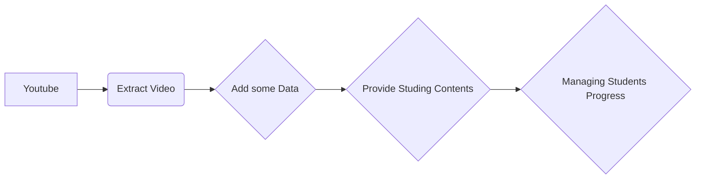

# YouTubeEnglishClass
English Study App using Youtube video

## Idea sketch for this Repo

### Goal

To provide good english studying platform. 

### Service Logic

```mermaid
graph LR
A[Youtube] -->B(Extract Video)
    B --> C{Add some Data}
    C --> D{Provide Studing Contents}
    D --> E{Managing Students Progress}
```
